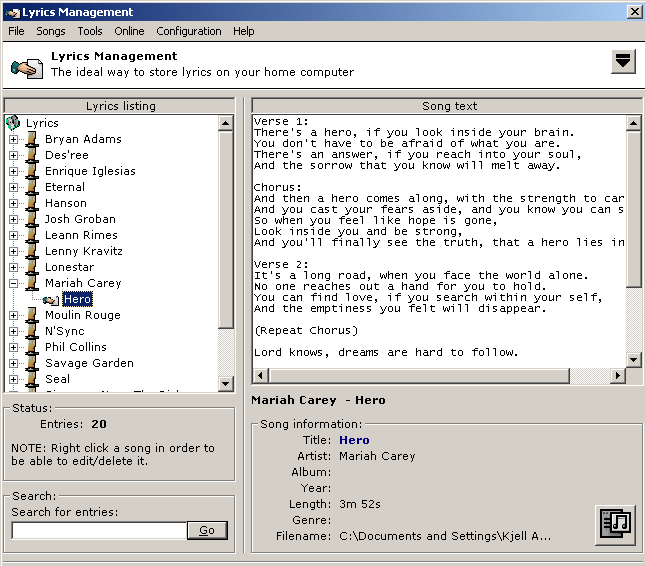



## Lyrics Management

### Description

Well, here you are - my own little Lyrics Management program. Free for you to learn from. The only reason I post it here, is so that others can learn from it, how to use div. advanced tecniques in order to create a dynamic GUI and more. Concisting of a online search engine as well as some other nice functions in order to have a nice Lyrics Management program.
 
### More Info
 

             |
---                |---
**Submitted On**   |2002-09-04 00:48:40
**By**             |[Kjell Arne Brudvik](https://github.com/Planet-Source-Code/PSCIndex/blob/master/ByAuthor/kjell-arne-brudvik.md)
**Level**          |Intermediate
**User Rating**    |4.3 (13 globes from 3 users)
**Compatibility**  |VB 5\.0, VB 6\.0
**Category**       |[Complete Applications](https://github.com/Planet-Source-Code/PSCIndex/blob/master/ByCategory/complete-applications__1-27.md)
**World**          |[Visual Basic](https://github.com/Planet-Source-Code/PSCIndex/blob/master/ByWorld/visual-basic.md)
**Archive File**   |[Lyrics\_Man1348159232002\.zip](https://github.com/Planet-Source-Code/kjell-arne-brudvik-lyrics-management__1-39201/archive/master.zip)

